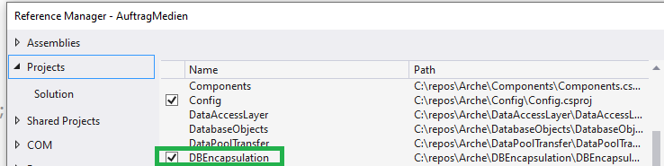
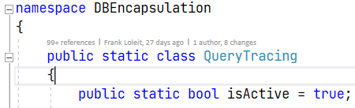
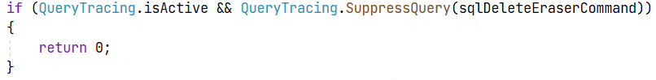
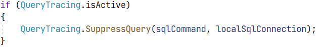
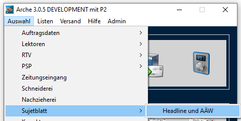
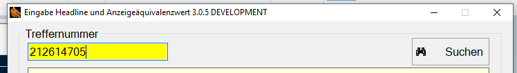
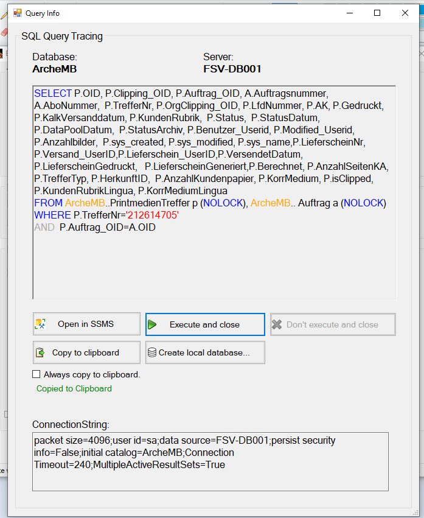
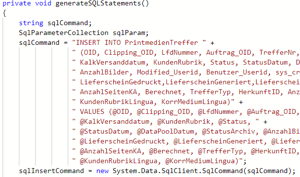
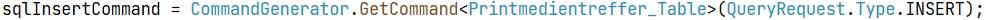
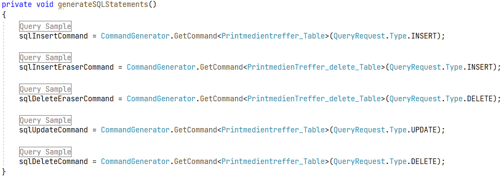

# DBEncapsulation Documentation
The DBEncapsulation module provides features such as query tracing for easier debugging when dealing with database sensitive issues. Furthermore it adds the possibility to automatically create **SqlCommand** objects based on database table models which are already implemented in the module.
## A. Query Tracing
### I. Activation process
A few steps are necessary in order to get query tracing running: 
1. Add the project reference to a an Arche project if not done yet (The module is already included in AuftragMedien):

2. Add a "using DBEncapsulation"-Statement to a persistence-class (e. g. ClippingPersistence.cs).
4. Make sure 'isActive' is set to 'true' in class 'Query Tracing' (must be false for release):

3. In the persistence-class in question find the methods which include ".Execute[Scalar/NonQuery]" or "new SqlDataAdapter".
4. In case of ".Execute[Scalar/NonQuery]" insert these very lines before the query is being executed (normally before "anzahl = ..."): 

Replace "sqlDeleteEraserCommand" with the corresponding SqlCommand object.
In case of "new SqlDataAdapter" just insert these lines before the adapter is being created:
 
"localSqlConnection" can differ from case to case. If you are unsure about where to put the correct lines check out "PrintmedienTrefferPersistence.cs" and search  for "QueryTracing". This will lead you to correct examples.
### II. Working with query tracing
1. Once DBEncapsualtion has been set up as explained above open a workflow which uses the persistence-class you added the module to. Open Arche-Starter and the corresponding workflow. "Headline und AÄW": 
 
2. Insert some treffernummer (e. g. 212614705) and click "Suchen": 
 
3. If everything works out a query tracing window will pop up:
 
**Note:** While Query Tracing is open Arche will be frozen and no query will be send to the server. The user interface is almost self-explanatory. Choose "Open in SSMS" to transfer the query to SSMS (if SSMS is not open yet, it will be started).
The "Create local database..."-Button will not open an Assistant but only transfer a "create database"-query to SSMS which creates the structure of "ArcheDB" (without content). Use query tracer to easily check which queries are being sent to the server without bothering about possible data change. In case of, insert, update or delete "Don't execute and close" will be available and query will be suppressed.
## B. Command Generator
This class does three things: 
* Generating insert-, update- and delete-queries based on database models.
* Generating datatype parameters based on the model's dataypes.
* Building an SqlCommand object based on the above two processes.
  
The general purpose of this class is to make manual creation of SqlCommand objects obsolete. The refactoring process is simple:
1. Open a persistence class.
2. Find the "generateSQLStatements"-method.
3. Identify the tables every query is referring to:
 
**Note:** Don't be confused by Arche's naming conventions. *sqlCommand* in this case does not refer to the .NET-Class and actually should just have been callse *query*.

In this case the table name is *PrintmedienTreffer*. The corresponding table model (you will find all table models in the DBEncapsulation's *TableModels* folder) is called *PrintmedienTreffer_Table*. So you only need to know the query type (insert, update or delete) and the table name. No delete all the code including the parameter section and replace it with:

 
In case of PrintmedienTrefferPersistence.cs the refactored version of *generateSqlStatements()* looks like this:
 

The regions named *Query Sample* are just the queries from the not refactored version. You do not need to include them.
Keep in mind that refactoring with DBEncapsulation only makes sense if you want to keep on developing Arche which currently (October of 2021) is not being planed by the PO.

